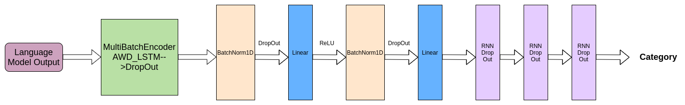

# AI-Hackathon-2020

A pytorch based model implemented in FastAi for the purpose of patent classification.

## Patent Classification Problem
Given the Patent Number, use the Google Patents to classify the patent category as Alcohol, Non Alcohol, Autonomous, Non Autonomous
AWD LSTM used for language model and Text Classification.

## Approach
1. Web Scraping, Tokenization and Numericalization (Preprocessing)
2. Language Model (AWD_LSTM)
3. Text Classifier
4. Fine tuning of hyperparameters

## Model for Text Classification

